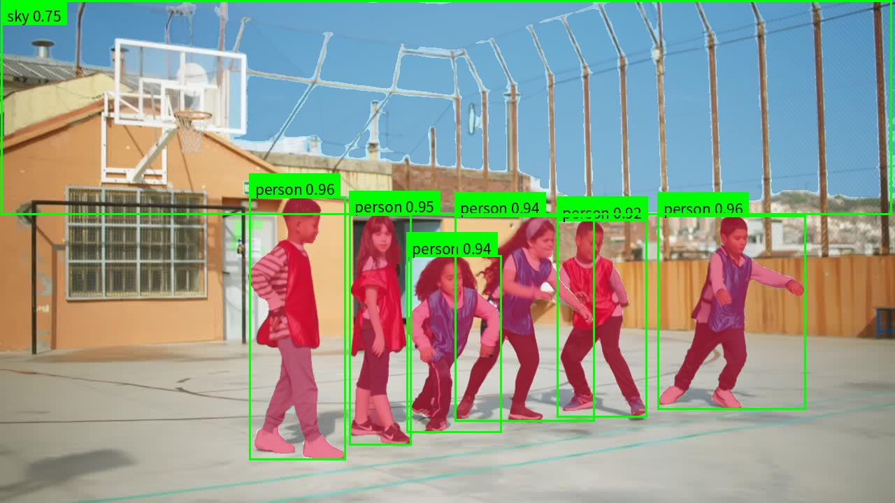

# AutoLabelX

`AutoLabelX` 是一个基于 `SAM3` 开发的自动批量预标注工具，面向图像数据集提供检测、实例分割、语义分割的一体化批量预标注流程，支持：

- 检测 `Detection`
- 实例分割 `Instance Segmentation`
- 语义分割 `Semantic Segmentation`

帮助快速生成高质量预标注结果，降低大规模数据标注的启动成本和重复劳动。

## 项目亮点

- 基于 `SAM3` 文本提示能力，按类别批量生成检测、实例分割与语义分割预标注结果。
- 单次运行同时产出中间类别结果和最终汇总结果，便于质量检查与后续修订。
- 支持每个类别独立配置提示词、阈值和可视化颜色，适合自定义数据集快速落地。
- 输出目录结构清晰统一，方便数据回流、人工复核与训练集整理。

## 效果展示

### 实例分割可视化



### 语义分割标签图


### 语义分割可视化


## 视频演示

- Bilibili 演示视频：`待补充`

## 环境要求

已验证环境：

- Ubuntu `20.
- CUDA `11.8`
- Python `3.12`
- PyTorch `2.6.0`

## 安装步骤

建议先创建并激活自己的 `conda` 环境：

```bash
conda create -n sam3 python=3.12 -y
conda activate sam3
```

安装依赖：

```bash
pip install -r requirements.txt
```

## 模型下载

运行前需要准备 `SAM3` 权重文件。

- Google Drive 下载地址：`待补充`

下载完成后，将权重文件放到你自己的路径，并在配置文件中通过 `checkpoint` 指定。例如：

```json
{
  "checkpoint": "assets/models/sam3.pt"
}
```

## 快速开始

使用项目自带示例配置运行：

```bash
conda activate sam3
python autolabelx.py --config configs/config.example.json
```

## 配置文件说明

推荐使用单一的 `classes` 结构，每个类别在一条配置里完整描述。

示例配置文件位置：

- configs/config.example.json

示例内容：

```json
{
  "image_dir": "assets/images",
  "output_root": "runs",
  "checkpoint": "assets/models/sam3.pt",
  "device": "cuda",
  "resolution": 1008,
  "ignore_index": 255,
  "classes": [
    {
      "id": 0,
      "name": "vehicle",
      "prompts": ["vehicle", "car", "truck", "pickup truck", "suv", "automobile"],
      "confidence_threshold": 0.35,
      "color_rgb": [0, 0, 142]
    },
    {
      "id": 1,
      "name": "person",
      "prompts": ["person", "people", "child", "kid", "human"],
      "confidence_threshold": 0.35,
      "color_rgb": [220, 20, 60]
    }
  ]
}
```

### 顶层字段

- `image_dir`
  原始图像目录，支持相对项目根目录路径
- `output_root`
  输出根目录，支持相对项目根目录路径
- `checkpoint`
  `SAM3` 权重路径，支持相对项目根目录路径
- `device`
  推理设备，通常使用 `cuda`
- `resolution`
  模型推理输入分辨率。图像会先缩放到该大小送入模型，再恢复到原图尺寸
- `ignore_index`
  语义分割中未命中类别的默认像素值，通常使用 `255`
- `classes`
  类别配置列表

### 类别字段

- `classes[].id`
  类别 ID，用于语义分割标签图
- `classes[].name`
  类别名称
- `classes[].prompts`
  推荐写法。多个独立提示词组成的列表，例如 `["person", "child", "kid", "human"]`
- `classes[].prompt`
  兼容写法。表示单个文本提示词字符串
- `classes[].confidence_threshold`
  该类别自己的实例保留阈值，必填
- `classes[].color_rgb`
  语义分割可视化颜色，按 `RGB` 顺序填写

## 如何编写自己的配置文件

建议按下面步骤组织自己的类别配置：

1. 先明确你的数据目录，把 `image_dir` 指向待处理图像根目录
2. 为每个语义类别分配稳定的 `id`
3. 为每个类别写清晰、尽量贴近视觉对象的 `prompts`
4. 为每个类别单独设置 `confidence_threshold`
5. 为每个类别指定一个易区分的 `color_rgb`

### 提示词建议

结合 `SAM3` 官方示例和说明，文本提示词建议遵循以下原则：

- 优先使用简洁、明确的自然语言名词或名词短语，例如 `person`、`shoe`、`pickup truck`
- 当类别存在同义表达或子类差异时，推荐使用 `prompts` 列表分别提供多个独立提示词
- 提示词应与目标视觉语义保持一致，避免把多个不相关描述混在同一条 prompt 中
- 如果某个类别容易与相邻类别混淆，优先补充更具体的目标短语，再结合类别阈值做调优

## 输出结果结构

运行后会在 `output_root` 下生成一个时间戳目录，例如：

```text
runs/
  <run_timestamp>/
    images/
    classes/
      vehicle/
        annotations/
        visualizations/
      person/
        annotations/
        visualizations/
    detection/
      annotations/
      visualizations/
    instance_segmentation/
      annotations/
      visualizations/
    semantic_segmentation/
      annotations/
      visualizations/
    manifest.json
```

### 各目录说明

- `images/`
  原始图像软链接，便于任务目录自包含管理
- `classes/<class>/annotations/`
  每个类别单独跑出的中间实例分割标注
- `classes/<class>/visualizations/`
  每个类别单独跑出的中间可视化结果
- `detection/annotations/`
  按图像聚合后的检测标注结果
- `detection/visualizations/`
  按图像聚合后的检测可视化结果
- `instance_segmentation/annotations/`
  按图像聚合后的实例分割标注结果
- `instance_segmentation/visualizations/`
  按图像聚合后的实例分割可视化结果
- `semantic_segmentation/annotations/`
  最终语义分割标签图，保存为 `.png`
- `semantic_segmentation/visualizations/`
  最终语义分割验证图，通常为“原图 + 彩色分割图”
- `manifest.json`
  本次任务的配置快照和运行信息记录

## 常见使用流程

推荐的工作流如下：

1. 准备图像目录
2. 下载并配置 `SAM3` 权重
3. 复制并修改 `configs/config.example.json`
4. 运行 `python autolabelx.py --config your_config.json`
5. 先检查 `classes/` 下每个类别的中间结果
6. 再检查 `detection/`、`instance_segmentation/`、`semantic_segmentation/` 的最终输出
7. 将结果用于人工修订或后续训练

## 当前限制

- 标注质量仍然依赖类别提示词设计和类别阈值设置
- 复杂遮挡、远小目标、强反光或类别歧义场景下，仍建议人工复核

## 致谢

本项目基于 `SAM3` 进行工程化扩展，实现了批量数据自动预标注、实例分割、语义分割与可视化流程封装。
